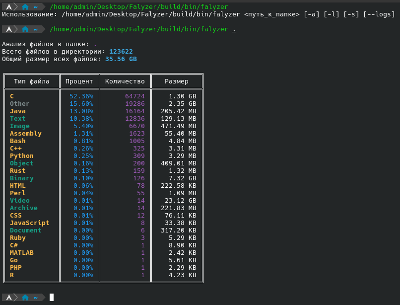
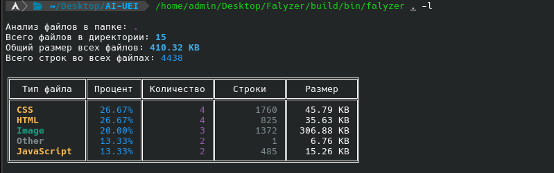
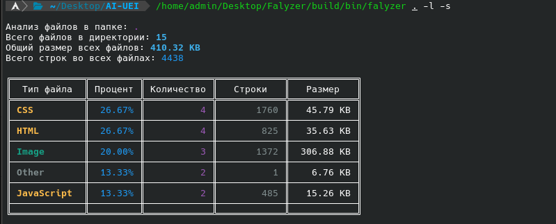
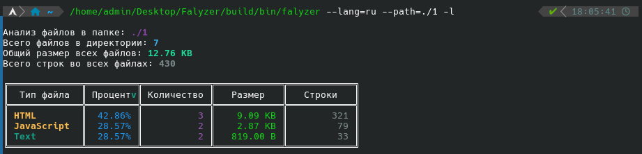
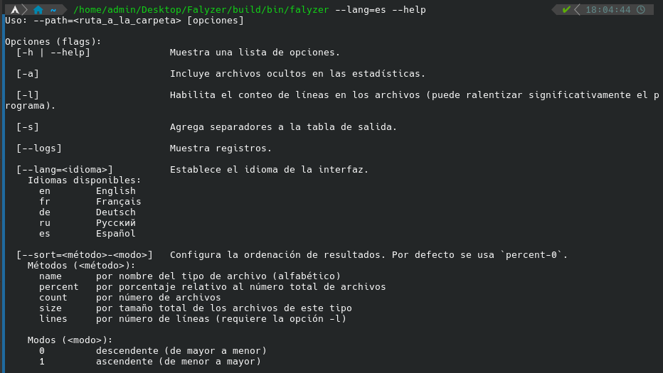
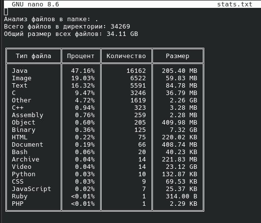
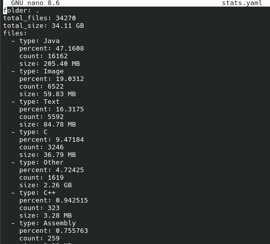
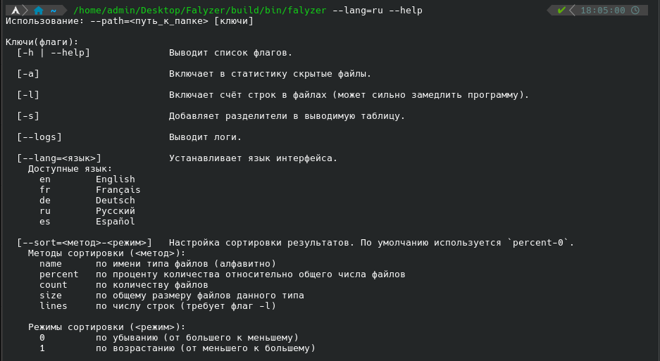

# Falyzer 


[🇬🇧 English (Translation)](#english) | [🇷🇺 Русский](#русский)


## English

**Falyzer** — a flexible tool for analyzing files of various formats.
It helps quickly extract useful information, automate processing, and integrate results into other systems.

[](https://pay.cloudtips.ru/p/204a4487)

---



---



---



---


---



---



---




## 🖥️ Usage

```bash
falyzer --path=<folder_path> [keys]
```

### Flags (keys)

- `-h` or `--help` — Displays the list of flags.
- `-a` — Includes hidden files in statistics.
- `-l` — Counts lines in files (may significantly slow down the program).
- `-s` — Adds separators in the output table.
- `--logs` — Outputs logs.
- `--out=<path_to_fail>` - retains statistics to the specified file. 

  **Supported output formats:** 
  - `TEXT` - a regular text file (`<name_file>.txt`) 
  - `JSON` - Data in JSON format (`<name_fila>.json`) 
  - `CSV` - table in CSV format (`<name_fila>.csv`) 
  - `YAML` - data in YAML format (`<name_fila>.yaml`)

- `--lang=<language>` — Sets the interface language. The default language is the system language.
  **Available languages**
  - `en` — English
  - `fr` — Français
  - `de` — Deutsch
  - `ru` — Русский
  - `es` — Español

- `--sort=<method>-<mode>` — Configures sorting of results.
  By default, `percent-0` is used. If you want descending order, you can omit `-0` (Example: `--sort=size` is equivalent to `--sort=size-0`).
  
  **Sorting methods (`<method>`)**
  - `name`    — by file type name (alphabetically)
  - `percent` — by percentage relative to the total number of files
  - `count`   — by number of files
  - `size`    — by total size of files of this type
  - `lines`   — by number of lines (requires `-l` flag)

  **Sorting modes (`<mode>`)**

  - `0` — descending (from larger to smaller)
  - `1` — ascending (from smaller to larger)


### Exceptions to statistics

In **Falyzer**, you can set a list of exceptions — files or folders that will not be taken into account during analysis.

To do this, create a `.falyzerignore` file in the directory from which Falyzer is launched.
<!-- If necessary, you can specify another file by passing its path through the `--ignore=<path to file>` parameter. -->

Example of the contents of the exception file:

```
.git
*.cpp
*.txt
```


## 🚀 Features

- Support for various file types.
- Flexible analysis settings tailored to tasks.
- Easy integration into existing projects.
- Extensible architecture.


## 🛠 Installation

1. **Clone or download the repository:**

   ```bash
   git clone https://github.com/ZZakharC/falyzer.git
   cd falyzer
   ```
2. **Build the program by running:**

   ```bash
   ./build/build.sh
   ```
   > ⚠ Building requires GCC or Clang version **12 or higher**.  
   > By default, g++ is used, but you can also build with clang++.
3. **Done**
   The executable is now located at `build/bin/falyzer`.
   


## Русский

**Falyzer** — это гибкий инструмент для анализа файлов различных форматов.  
Он помогает быстро извлекать полезную информацию, автоматизировать обработку и интегрировать результаты в другие системы.

[](https://pay.cloudtips.ru/p/204a4487)

---



---


---


---


---


---


---


## 🖥️Использования
```bash
falyzer --path=<путь_к_папке> [ключи]
```

### Флаги (ключи)
- `-h` или `--help` - Выводит список флагов.
- `-a` - Включает в статистику скрытые файлы.
- `-l` - Включает счёт строк в файлах (может сильно замедлить программу).
- `-s` - Добавляет разделители в выводимую таблицу.
- `--logs` - Выводит логи.
- `--out=<путь_к_файлу>` — сохраняет статистику в указанный файл.

  **Поддерживаемые форматы вывода:**
  - `TEXT` — обычный текстовый файл (`<имя_файла>.txt`)
  - `JSON` — данные в формате JSON (`<имя_файла>.json`)
  - `CSV` — таблица в формате CSV (`<имя_файла>.csv`)
  - `YAML` — данные в формате YAML (`<имя_файла>.yaml`)

- `--lang=<язык>` - Устанавливает язык интерфейса. По умолчанию используется язык системы

  **Доступные языки**
  - `en` — English  
  - `fr` — Français  
  - `de` — Deutsch  
  - `ru` — Русский  
  - `es` — Español  

- `--sort=<метод>-<режим>` — Настройка сортировки результатов.  
  По умолчанию используется `percent-0`. Если вы хотите сортировку от большего к меньшему то `-0` можно не писать (Пример: `--sort=size` равносильно `--sort=size-0`)  

  **Методы сортировки (`<метод>`)**
    - `name`    — по имени типа файлов (алфавитно)  
    - `percent` — по проценту количества относительно общего числа файлов  
    - `count`   — по количеству файлов  
    - `size`    — по общему размеру файлов данного типа  
    - `lines`   — по числу строк (требует флаг `-l`)  

  **Режимы сортировки (`<режим>`)**
    - `0`       — по убыванию (от большего к меньшему)  
    - `1`       — по возрастанию (от меньшего к большему)  


### Исключения из статистики

В **Falyzer** можно задать список исключений — файлов или папок, которые не будут учитываться при анализе.

Для этого создайте файл `.falyzerignore` в директории, из которой запускается Falyzer.
<!-- При необходимости можно указать другой файл, передав его путь через параметр `--ignore=<путь_к_файлу>`. -->

Пример содержимого файла исключений:

```
.git
*.cpp
*.txt
```


## 🚀 Возможности
- Поддержка различных типов файлов.
- Гибкая настройка анализа под задачи.
- Простое подключение к существующим проектам.
- Расширяемая архитектура.


## 🛠 Установка
1. **Клонируйте или скачайте репозиторий:**
    ```bash
    git clone https://github.com/ZZakharC/falyzer.git
    cd falyzer
2. **Собирите программу запустив:**
    ```bash
    ./build/build.sh
    ```
    > ⚠ Для сборки требуется `GCC` или `Clang` версии **12 или выше**.  
    > По умолчанию используется `g++`, но можно также собрать через `clang++`.

3. **Готово**  
  Теперь исполняемый файл находится `build/bin/falyzer`.
  